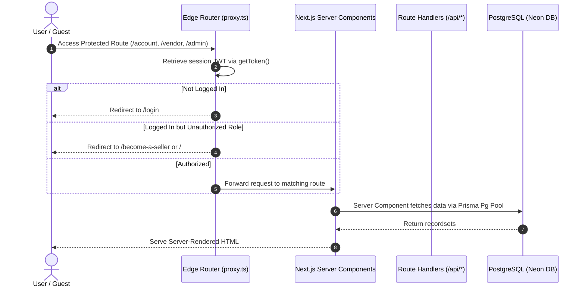
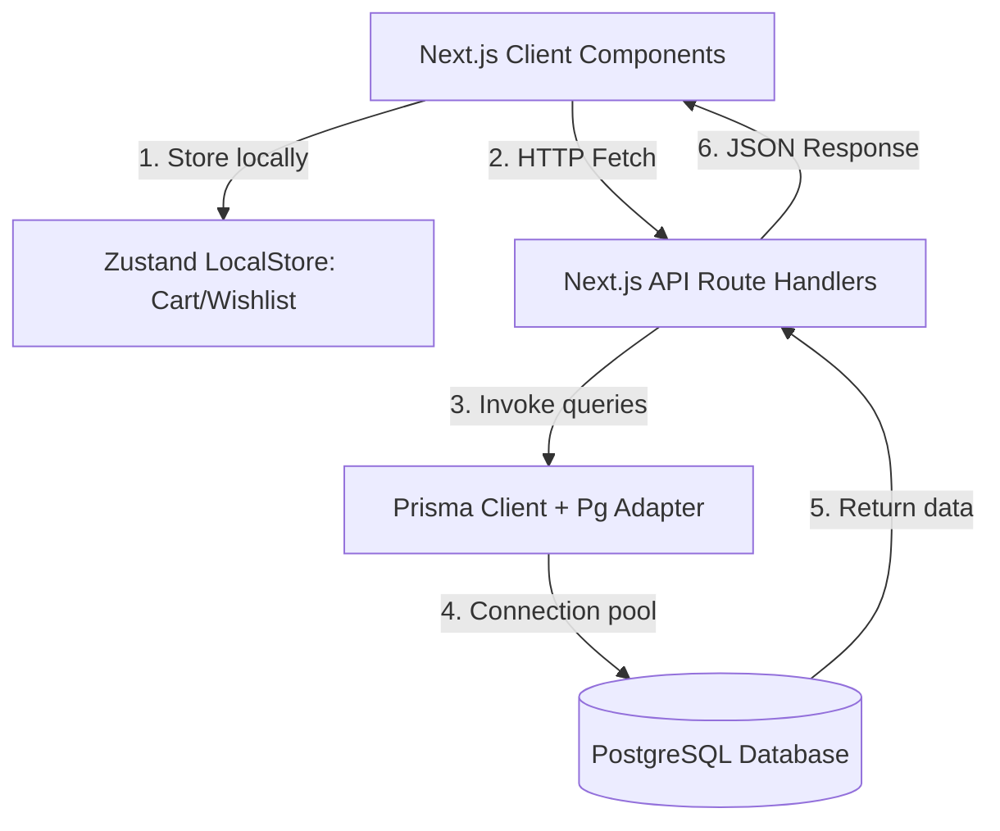
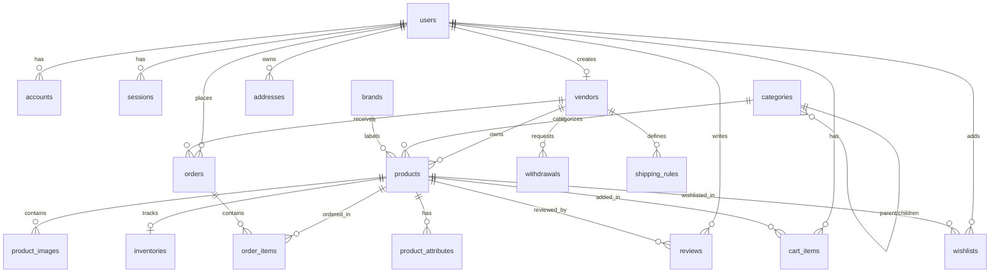

# Modest Kouture — Premium Fashion Marketplace

Welcome to the **Modest Kouture** codebase. Modest Kouture is a modern, premium multi-vendor fashion marketplace built using Next.js, React, Prisma, Tailwind CSS v4, and PostgreSQL. It allows independent fashion designers, boutique sellers, and brand owners to list, manage, and sell their products globally, while offering customers a luxury shopping experience for modest clothing, jewelry, beauty, and lifestyle items.

---

## Table of Contents

1. [Project Overview](#project-overview)
2. [Technology Stack](#technology-stack)
3. [Architecture Overview](#architecture-overview)
4. [Folder Structure](#folder-structure)
5. [Database Documentation & ERD](#database-documentation--erd)
6. [Features Implemented & Gaps](#features-implemented--gaps)
7. [API Documentation](#api-documentation)
8. [Authentication & Authorization](#authentication--authorization)
9. [Environment Variables](#environment-variables)
10. [Setup & Installation](#setup--installation)
11. [Build & Deployment](#build--deployment)
12. [Third-Party Integrations](#third-party-integrations)
13. [Code Quality & Technical Debt](#code-quality--technical-debt)
14. [Developer Notes & Patterns](#developer-notes--patterns)

---

## Project Overview

### Business Purpose & Goals
Modest Kouture serves as a curated digital boutique destination focusing on the modest fashion industry. It solves the fragmentation of the modest fashion market by aggregating global designers, brands, and independent vendors into a single, high-end e-commerce ecosystem. The platform empowers sellers with dedicated business tooling (vendor dashboards, earnings tracking, and withdrawal requests) and offers customers search controls, personalized wishlists, and vendor store profiling.

### Target Audience
*   **Customers**: Individuals looking for curated modest clothing, abayas, hijabs, modest jewelry, beauty, and luxury lifestyle products.
*   **Vendors**: Boutique owners, fashion designers, and independent merchants specializing in modest lifestyle collections.
*   **Platform Administrators**: Store operators who review and approve vendor applications, monitor transactions, and moderate products.

---

## Technology Stack

The application leverages a modern, typesafe stack optimized for speed, scalability, and design excellence:

*   **Frontend Framework**: Next.js 16.2.7 (App Router) with React 19.2.4 for Server-Side Rendering (SSR), Static Site Generation (SSG), and client-side hydration.
*   **Backend Runtime**: Next.js Route Handlers (RESTful API endpoints).
*   **Database**: PostgreSQL hosted on **Neon Database** (Serverless server).
*   **ORM**: **Prisma 7.8.0** configured with `@prisma/adapter-pg` and the serverless `pg` PostgreSQL connection pool.
*   **Authentication & Sessions**: **NextAuth.js v5.0.0-beta.31** (Auth.js) with `@auth/prisma-adapter` for database sessions.
*   **State Management**: **Zustand 5.0.14** with the `persist` middleware for local-storage client-side state caching.
*   **Styling**: **TailwindCSS v4.0.0** using dynamic HSL color variables, premium shadows, and custom font configs.
*   **UI Components**: **Radix UI** primitives (dialog, select, dropdown-menu, tabs, progress, and avatars) and **Lucide React** for icons.
*   **Animations**: **Framer Motion 12.40.0** and **Tailwind CSS Animate** for smooth micro-interactions.
*   **Forms & Validation**: **React Hook Form 7.77.0** resolved with **Zod 4.4.3** schemas via `@hookform/resolvers`.
*   **Payment Gateway**: **Stripe SDK 22.2.0** and **@stripe/stripe-js 9.7.0** *(library is initialized but checkout integration is pending)*.
*   **Cloud Image Service**: **Cloudinary** via `next-cloudinary` for cloud-based media asset uploads.
*   **Email Deliverability**: **Resend SDK 6.12.4** for automated system emails.

---

## Architecture Overview

Modest Kouture utilizes a hybrid rendering architecture. Client components manage fast, stateful interactions (like the search bar, cart drawer, and sliders), while Server Components handle static layout framing, SEO generation, and database-authenticated routing.

### Request & Authentication Flow



### Data & Client-Server Interaction



---

## Folder Structure

Below is the layout of the project directories and key files:

```text
├── .env.local                    # Local environment variables
├── components.json               # Shadcn UI configuration file
├── eslint.config.mjs             # Linting rule configuration
├── next.config.ts                # Next.js configurations & image remote patterns
├── postcss.config.mjs            # PostCSS configurations for TailwindCSS v4
├── proxy.ts                      # Edge-ready routing middleware file (role check)
├── tsconfig.json                 # TypeScript compiler configuration
├── app/                          # Next.js App Router (pages, layouts, and API routes)
│   ├── (admin)/                  # Admin route group (restricted paths)
│   │   ├── admin/
│   │   │   ├── dashboard/page.tsx# Admin platform metrics
│   │   │   ├── products/page.tsx # Product review panel
│   │   │   ├── users/page.tsx    # User list view
│   │   │   └── vendors/page.tsx  # Vendor status moderation
│   │   └── layout.tsx            # Admin layout (forces ADMIN check)
│   ├── (auth)/                   # Login & registration pages
│   │   ├── layout.tsx            # Authentication page layout wrapper
│   │   ├── login/page.tsx        # Login form page
│   │   └── register/page.tsx     # Registration form page
│   ├── (store)/                  # Customer-facing shopping routes
│   │   ├── account/              # Customer portal (addresses, orders, profile)
│   │   ├── become-a-seller/      # Vendor registration landing page
│   │   ├── cart/page.tsx         # Shopping cart page (standalone mock)
│   │   ├── category/[slug]/      # Category browsing page
│   │   ├── shop/                 # Product catalog and sorting filter page
│   │   ├── shop/[slug]/page.tsx  # Product details page (mock data presentation)
│   │   ├── vendors/              # Public directory of vendors
│   │   └── layout.tsx            # Customer header, navigation, and footer wrapper
│   ├── api/                      # Next.js REST API Route Handlers
│   │   ├── auth/                 # Auth.js routes & email registration endpoint
│   │   ├── cart/route.ts         # DB-backed cart items endpoint
│   │   ├── orders/route.ts       # DB-backed order management & splitting endpoint
│   │   ├── products/route.ts     # DB-backed product listing & creation endpoint
│   │   └── wishlist/route.ts     # DB-backed wishlist toggle endpoint
│   ├── globals.css               # Tailwind CSS base styling & Radix animations
│   └── layout.tsx                # Base HTML document & NextAuth SessionProvider
├── components/                   # Shared UI components
│   ├── cart/                     # CartDrawer overlay component
│   ├── home/                     # Home page sections (sliders, showcases, cards)
│   ├── layout/                   # Header, Footer, Admin and Vendor Sidebars
│   └── ui/                       # Radix UI wrapper primitives & Custom icons
├── lib/                          # Backend and utility core logic
│   ├── validations/              # Zod validation schemas (auth, product, store)
│   ├── animations.ts             # Framer Motion animation utility configs
│   ├── auth.ts                   # NextAuth options, callbacks, and providers
│   ├── prisma.ts                 # Prisma Client setup with Pg adapter pooling
│   ├── stripe.ts                 # Stripe client configuration
│   └── utils.ts                  # Number formatting, slugify, and helper utilities
├── prisma/                       # Database schema and seeding files
│   ├── schema.prisma             # Core Prisma schema model file
│   └── seed.ts                   # Database seed script for initial testing
├── store/                        # Zustand global client stores
│   ├── cartStore.ts              # LocalStorage persistent shopping cart state
│   └── wishlistStore.ts          # LocalStorage persistent wishlist state
└── types/                        # TypeScript type definitions
    └── index.ts                  # Auth.js module typings (User ID/Role overrides)
```

### Core System Configuration Files
*   **`proxy.ts`**: Contains the route middleware logic that checks NextAuth JWTs on edge servers to protect `/account`, `/vendor`, and `/admin` routes.
*   **`lib/auth.ts`**: Configures the Google OAuth and Credentials login flow, verifying hashed passwords with `bcryptjs`.
*   **`lib/prisma.ts`**: Implements global caching of `PrismaClient` in local development to avoid pool overflow and configures PostgreSQL over PG Adapter.
*   **`prisma/schema.prisma`**: The single source of truth for the database layout.

---

## Database Documentation & ERD

### Database Design & Schema Design Decisions
1.  **Multi-Vendor Order Splitting**: Customers can add items from different vendors to a single cart. During checkout, the orders are grouped by `vendorId` and split into individual `Order` rows in the database, allowing each vendor to manage their own shipments independently.
2.  **Order Line Snapshots**: To prevent historical order records from breaking when a product changes prices or is deleted, the `OrderItem` table duplicates fields like `title`, `price`, and `image` at the exact moment of order placement.
3.  **Recursive Self-Relation Categories**: The `Category` model connects to itself (`parent` and `children`) allowing unlimited hierarchy levels (e.g. `Women -> Clothing -> Abayas`).
4.  **Hashed Credentials & OAuth Integration**: Stores credentials directly in the `users` table while allowing third-party accounts (Google) to link via the standard `accounts` NextAuth structure.

### Entity Relationship Diagram (ERD)



---

## Features Implemented & Gaps

The project contains a mismatch between a **fully implemented database-backed REST API** and a **partially completed frontend** that relies on mock data and local browser storage.

### 1. Customer Workflows
*   **Catalog Browsing**: Browse categories and shops.
    *   *Backend*: Supports `/api/products` with pagination, price ranges, search matching, and sorting criteria.
    *   *Frontend*: Renders mockup arrays of 24 products generated randomly in client files (`app/(store)/shop/page.tsx`, `app/(store)/category/[slug]/page.tsx`).
*   **Wishlist & Cart**: Add, modify quantity, or delete items.
    *   *Backend*: Fully written endpoints (`/api/cart`, `/api/wishlist`) persisting guest/user states to DB.
    *   *Frontend*: Zustand stores (`useCartStore`, `useWishlistStore`) save items in `localStorage`. They do not fetch or push to the backend API endpoints. The cart page (`app/(store)/cart/page.tsx`) uses a hardcoded local array instead of using the Zustand cart store.
*   **Checkout**:
    *   *Backend*: Order generation splits items per vendor and clears DB-backed user carts.
    *   *Frontend*: The `/checkout` path is **not found in the codebase**. Clicking checkout leads to a 404 page.

### 2. Vendor Workflows
*   **Onboarding**: Landing page explaining rates and tiers.
    *   *Related files*: [become-a-seller/page.tsx](file:///app/(store)/become-a-seller/page.tsx)
*   **Vendor Dashboard**: Overview of earnings, orders, and product count.
    *   *Status*: Displays frontend static mockups. No backend DB connection is made in `app/(vendor)/vendor/dashboard/page.tsx`.
*   **Add Product Form**: Adding titles, descriptions, categories, price, stock, weight, and tags.
    *   *Status*: Renders a complete form. However, saving a product calls an artificial 1.2s timeout before triggering a "Product saved as draft!" toast. It does not send a POST request to `/api/products`.

### 3. Administrator Workflows
*   **Moderation Panel**: View system revenue, moderate products, verify user accounts, and approve/reject pending vendors.
    *   *Status*: The admin layouts require `ADMIN` authentication, but the pages (`app/(admin)/admin/dashboard/page.tsx`) are loaded with static mock data.

---

## API Documentation

The REST API handlers are located inside `/app/api`. They are fully functional and expect JSON payloads where applicable:

### 1. Registration (`/api/auth/register`)
*   **Method**: `POST`
*   **Auth Required**: None
*   **Request Payload**:
    ```json
    {
      "name": "Jane Doe",
      "email": "jane@example.com",
      "password": "strongpassword123"
    }
    ```
*   **Success Response** (201 Created):
    ```json
    {
      "user": {
        "id": "cuid-string",
        "name": "Jane Doe",
        "email": "jane@example.com",
        "role": "CUSTOMER"
      }
    }
    ```

### 2. Products (`/api/products`)
*   **Method**: `GET` (Fetch public active products with filtering)
    *   *Query Params*: `search`, `category`, `minPrice`, `maxPrice`, `sort` (`newest`, `price_asc`, `price_desc`, `popular`, `rating`), `page`, `limit`
    *   *Response*: List of products, page indicators, and total counts.
*   **Method**: `POST` (Create a product - restricted to approved vendors)
    *   *Auth Required*: Yes (Role: `VENDOR` or `ADMIN`)
    *   *Request Payload*:
        ```json
        {
          "title": "Silk Maxi Dress",
          "description": "Premium silk maxi dress...",
          "price": 120.00,
          "salePrice": 99.00,
          "categoryId": "cuid-category-id",
          "quantity": 10,
          "trackStock": true,
          "allowBackorder": false,
          "lowStockAt": 3
        }
        ```
    *   *Response* (201 Created): Created product object with nested inventory details.

### 3. Cart Items (`/api/cart`)
*   **Method**: `GET` (Fetch authenticated user's cart or guest cart via cookie session)
*   **Method**: `POST` (Add item / update quantity)
    *   *Request Payload*: `{"productId": "prod-id", "quantity": 1}`
*   **Method**: `DELETE`
    *   *Query Params*: `?itemId=cart-item-id`

### 4. Wishlists (`/api/wishlist`)
*   **Method**: `GET` (Fetch user's wishlist)
*   **Method**: `POST` (Toggles the user's wishlist relationship with a product)
    *   *Request Payload*: `{"productId": "prod-id"}`
    *   *Response*: `{"wishlisted": true | false}`

### 5. Orders (`/api/orders`)
*   **Method**: `GET` (Fetch user orders, or vendor orders matching vendorId)
*   **Method**: `POST` (Checkout order creation)
    *   *Auth Required*: Yes
    *   *Request Payload*:
        ```json
        {
          "items": [{"productId": "id-1", "quantity": 2}],
          "shippingAddress": {
            "name": "Jane Doe",
            "street": "123 High St",
            "city": "London",
            "country": "UK",
            "zip": "NW1 1AA"
          },
          "couponCode": "WELCOME15",
          "paymentIntentId": "pi_stripe_id"
        }
        ```

---

## Authentication & Authorization

### Session & Cookie Policies
*   Sessions are stored using JWT tokens (`strategy: "jwt"` in NextAuth) containing the user `id` and `role`.
*   Unauthenticated users can add items to carts using a browser-assigned session cookie (`cart-session`), which routes through `/api/cart`.

### Role-Based Access Controls (RBAC)
User access control is applied at multiple entry levels:
1.  **Edge Routing Matcher**: `proxy.ts` performs matching before hitting layouts. It parses JWTs and protects routes:
    *   `/account/:path*` (Forces authenticated `CUSTOMER`, `VENDOR`, or `ADMIN`)
    *   `/vendor/:path*` (Forces `VENDOR` or `ADMIN`)
    *   `/admin/:path*` (Restricted entirely to `ADMIN` role)
2.  **Server layouts**: Server-side checks double-guard routes to redirect unauthorized users (e.g. `app/(admin)/layout.tsx`).
3.  **API Handler Guards**: Individual route handlers retrieve database session info and return `401 Unauthorized` or `403 Forbidden` if permissions do not match.

---

## Environment Variables

Configure these settings inside `.env.local` for local execution.

| Variable | Required | Description |
| :--- | :--- | :--- |
| `DATABASE_URL` | Yes | Connection string for PostgreSQL database. In production, this requires SSL parameters (`sslmode=require`). |
| `AUTH_SECRET` | Yes | Secure cryptographic string used by NextAuth to sign and encrypt JWTs (minimum 32 characters). |
| `AUTH_URL` | Yes | The base URL of the application (e.g., `http://localhost:3000` in development). |
| `AUTH_GOOGLE_ID` | No | Client ID for Google OAuth authentication provider. |
| `AUTH_GOOGLE_SECRET` | No | Client Secret for Google OAuth authentication provider. |
| `STRIPE_SECRET_KEY` | No | Secret API key for Stripe payment processor. |
| `NEXT_PUBLIC_STRIPE_PUBLISHABLE_KEY` | No | Public API key for Stripe checkout elements. |
| `STRIPE_WEBHOOK_SECRET` | No | Secret token to verify incoming webhooks from Stripe events. |
| `NEXT_PUBLIC_CLOUDINARY_CLOUD_NAME` | Yes | Cloudinary Cloud name for image upload storage. |
| `CLOUDINARY_API_KEY` | Yes | API Key for authenticating Cloudinary uploads. |
| `CLOUDINARY_API_SECRET` | Yes | API Secret for authenticating Cloudinary uploads. |
| `RESEND_API_KEY` | No | API key for the Resend email service. |
| `NEXT_PUBLIC_APP_URL` | Yes | Public facing URL of the application. |
| `NEXT_PUBLIC_APP_NAME` | Yes | Name of the application (e.g., "Modest Kouture"). |

---

## Setup & Installation

### Prerequisites
*   **Node.js** (v18.0.0 or higher recommended)
*   **npm** (v9.0.0 or higher) or equivalent package manager
*   **PostgreSQL** instance (local server or cloud service like Neon)

### Installation Steps
1.  **Clone or Open project directory**:
    ```bash
    cd c:\Users\my computer\Desktop\Prototype\stud
    ```
2.  **Install dependencies**:
    ```bash
    npm install
    ```
3.  **Configure Environment**:
    Create `.env.local` file in the root and fill in the database URL, secrets, and integration keys.
4.  **Database Migration**:
    Push the schema configuration to your PostgreSQL database:
    ```bash
    npx prisma db push
    ```
5.  **Seed the Database**:
    Initialize categories, test products, and mock users for testing:
    ```bash
    npx tsx prisma/seed.ts
    ```
6.  **Prisma Client Generation**:
    Build the typesafe client matching your local schema:
    ```bash
    npx prisma generate
    ```
7.  **Run Development Server**:
    Start the local server:
    ```bash
    npm run dev
    ```
    Access the application at `http://localhost:3000`.

---

## Build & Deployment

### Build Command
Compile the application for production using:
```bash
npm run build
```
This runs the script command `prisma generate && next build`.

### Production Considerations
*   **Prisma Engine in Serverless**: Ensure database connection pooling is optimized. Neon databases handle pooling automatically through the pooler endpoint.
*   **SSL Requirement**: PostgreSQL connections in production require SSL variables added to the query configuration string: `?sslmode=require`.
*   **Cold Start Optimizations**: Keep server route footprints small. The project uses NextAuth's edge compatibility and a lightweight connection wrapper to avoid database initialization delays.

---

## Third-Party Integrations

*   **Cloudinary**: Media assets are hosted and processed through Cloudinary to keep DB sizes small and improve page response speeds.
*   **Resend**: Integration template exists for sending transactional templates (order updates, password changes).
*   **Stripe**: A config client exists in `lib/stripe.ts` using API version `2026-05-27.dahlia` with typescript types enabled. Full frontend payment elements must be implemented.

---

## Code Quality & Technical Debt

### Architectural Strengths
*   **Edge Routing**: The `proxy.ts` middleware file keeps JWT authentication checks light and fast by validating tokens at the edge, saving main servers from database hit bottlenecks.
*   **Vendor Group Order Splitting**: The database-backed order creation endpoint handles multi-vendor checkouts robustly.
*   **TailwindCSS v4 Layout**: High-performance CSS compiling and premium animations configured natively via base styles.

### Technical Debt / Areas for Improvement
*   **Static Mock pages**: Frontend shop routes (`/shop`, `/category/[slug]`, `/vendors/[slug]`) and dashboard pages (`/vendor/dashboard`, `/admin/dashboard`) run on static arrays and need integration with the `/api/*` endpoints.
*   **Zustand Syncing**: Local storage stores (`useCartStore`, `useWishlistStore`) run separately from the backend `/api/cart` and `/api/wishlist` endpoints and need to be synchronized on user login.
*   **Missing Checkout Page**: The checkout page (`/checkout`) is not present in the code and must be created to support order processing.
*   **Unused Stripe Setup**: The Stripe integration is initialized in helper folders but payment gates are not yet connected to client views.

---

## Developer Notes & Patterns

### Important Conventions
*   **Next.js 16 SearchParams Pattern**: In Next.js 16, page properties like `params` and `searchParams` are asynchronous promises. Always `await` them before usage:
    ```typescript
    export default async function ProductDetailPage({ params }: { params: Promise<{ slug: string }> }) {
      const { slug } = await params;
      // ...
    }
    ```
*   **CSS Class Margins**: Use `cn(...)` utility helper when combining conditional classes dynamically to avoid conflict issues with Tailwind compilation:
    ```typescript
    className={cn("text-sm transition-colors", isActive && "text-gold font-bold")}
    ```
*   **Prisma Client Singleton**: Do not instantiate `PrismaClient` inside component loops or router files. Import the shared `prisma` client from `@/lib/prisma`.
